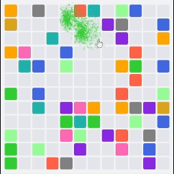

## Pop 
### Simple to Play, Impossible to Stop! Just Pop!!

Pop is a color-matching puzzle game built using Devvit and React. Players can click on blank blocks to match and collect colored blocks, earning points and creating chain reactions for higher scores.

What makes Pop special is its emphasis on color, animations, and interactivity. I’ve designed it to be visually captivating, with bright, colorful blocks and smooth, satisfying animations. The "pop" effect when blocks match feels rewarding, making each click more exciting.



### How to Play

- **Start the Game**: Navigate to the Pop game page within Reddit.
- **Click on Blank Blocks**: Trigger the game logic by clicking on blank spaces in the grid.
- **Match Colors**: Collect matching blocks by finding the nearest horizontally or vertically adjacent block of the same color.
- **Score Points**: Earn points for every match and boost your score with matching more blocks.
- **Climb the Leaderboard**: Compete with others in the Reddit community to top the leaderboard.

In this game, you need to think ahead—one wrong pop could block potential future moves. The more you plan, the higher your score. Challenge yourself to find the best combinations and make every pop count.

You can visit this [link](https://www.reddit.com/r/CrosswordCorner/comments/1hfqs60/pop_7/) to play the game.

### Credits

This project was made possible using the following open source code:

1. Devvit Webview React - Used as the base template for building Reddit apps with React & webview.
2. Redis Integration in Game - Referred code from this repository to understand how to use redis to store players scores and game data.

Huge thanks to [mwood23](https://github.com/mwood23/) for sharing these links on discord! 🙌

### Tech

- [Devvit](https://developers.reddit.com/docs/): Reddit’s Developer Platform that lets you build powerful apps and experiences to enhance the communities you love.
- [Vite](https://vite.dev/): Advanced build tool for the web
- [React](https://react.dev/): UI Library for the web
- [TailwindCSS](https://tailwindcss.com/): Utility first CSS framework
- [Typescript](https://www.typescriptlang.org/): Strongly typed Javascript superset
- [Motion](https://motion.dev/): Animation Library
- [Lucide React](https://lucide.dev/icons/): For icons

## Setting up your own pop game

> Make sure you have Node 22 downloaded on your machine before running!

```sh
git clone https://github.com/raibove/pop.git

cd pop

npm install
```

Before continuing, make a subreddit on Reddit.com. This will be where you do your own development. Go to Reddit.com, scroll the left side bar down to communities, and click "Create a community."

Next, go to the `package.json` and update see the `dev:devvit` command. Update the command to have you subreddit name.

Finally go to `devvit.yaml` and name your app. It has to be 0-16 characters. Once you have, click save, and run `npm run upload` from the root of the repository.

Now all you have to do is run `npm run dev` and navigate to the subreddit.

There is one last gotcha! You need to make a new post before you can see it. You can do so by going to your subreddit, clicking the three dots, and tapping "Create pop game". After you start developing your all please update the menu item copy (found in `src/main.tsx`).

## Commands

- `npm run dev`: Starts a development server where you can develop your application live on Reddit.
- `npm run upload`: Uploads a new version of your app
- `npm run vite`: Useful to run just the React app on your machine if you need to style things quickly.

# Contributing

Any contributions to improve Pop are welcomed! To contribute:
- Fork the repository
- Create a new branch for your feature or bug fix
- Submit a pull request with a clear description of your changes

# Contact

For questions or feedback, reach out to raibove on [X](https://x.com/shweta_kale1).